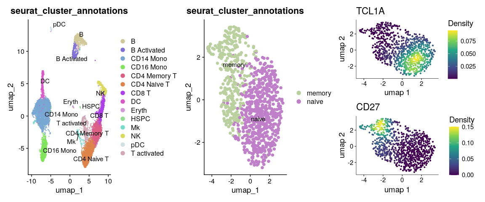
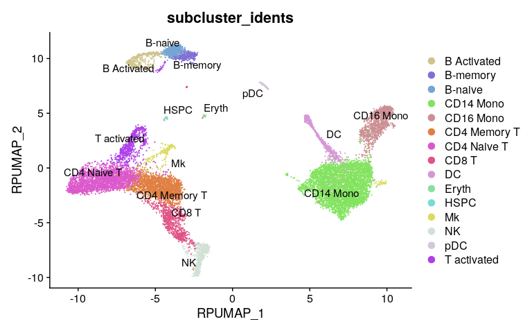
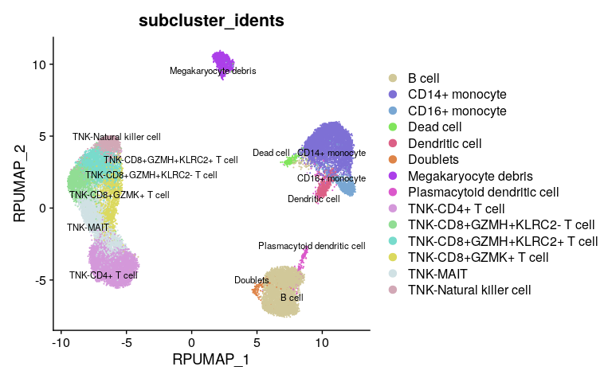
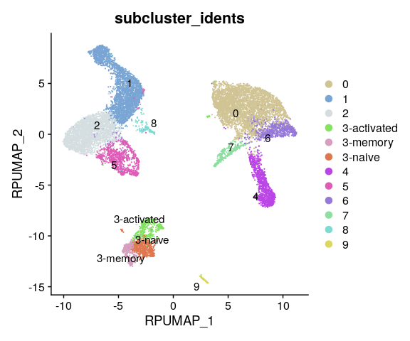
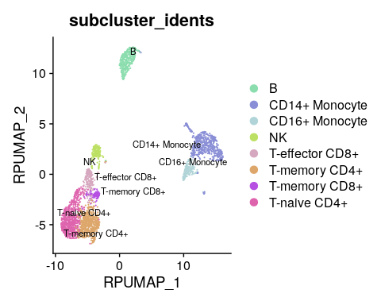

Examples for cross compatibility with different integration and
clustering methods
================
Jinghua Gu, Uthra Balaji
2024-04-15

- [1 Motivation](#1-motivation)
- [2 Examples](#2-examples)
  - [2.1 Example 1: Seurat (V5)
    integration](#21-example-1-seurat-v5-integration)
  - [2.2 Example 2: fastMNN (from Seurat
    Wrapper)](#22-example-2-fastmnn-from-seurat-wrapper)
  - [2.3 Example 3: LIGER](#23-example-3-liger)
  - [2.4 Example 4: Semi-supervised re-clustering by
    SCISSORS](#24-example-4-semi-supervised-re-clustering-by-scissors)

<span style="color:red">Note: Seurat V5 is required to load and run the
pre-built Seurat objects in this tutorial (we recommend using the Ragas
docker on our Github main page). However, other than example 1, most of
the code in this tutorial is compatible with older versions of
Seurat.</span>

# 1 Motivation

In scRNA-Seq studies with a multi-sample design, essential data
preprocessing steps, including batch integration and dimension
reduction, need to be performed before clustering. When developing
Ragas, we intend to provide a flexible interface so users can apply
Ragas for subcluster integration based on different scRNA-Seq workflows.
In the “QuickStart” and “subcluster” vignettes, we demonstrated
subclustering integration using harmony-corrected principal components.
In this tutorial, we are going to illustrate performing Ragas subcluster
re-projection using data processed by different scRNA-Seq workflows.

# 2 Examples

## 2.1 Example 1: Seurat (V5) integration

- Dataset description: IFNB-Stimulated and control PBMCs
- Batch integration method: Seurat CCA
- Number of reduced dimensions: 30
- Clustering method: original Louvain algorithm
- Cell type re-clustered: B cells

``` r
library(Ragas)
library(Nebulosa)
```

``` r
## Load PBMC object
ifnb <- readRDS(url("https://wcm.box.com/shared/static/j5cpgg590svc6cr8idfkl5116tzqkmxw.rds", "rb"))
ifnb
```

    ## An object of class Seurat 
    ## 14053 features across 13999 samples within 1 assay 
    ## Active assay: RNA (14053 features, 2000 variable features)
    ##  3 layers present: data, counts, scale.data
    ##  3 dimensional reductions calculated: pca, integrated.cca, umap

``` r
## Load re-clustered B object
ifnb.bcell <- readRDS(url("https://wcm.box.com/shared/static/r11x4f7r4520er7ae6mv961hyahiwbpg.rds", "rb"))
ifnb.bcell
```

    ## An object of class Seurat 
    ## 14053 features across 897 samples within 1 assay 
    ## Active assay: RNA (14053 features, 2000 variable features)
    ##  3 layers present: data, counts, scale.data
    ##  3 dimensional reductions calculated: pca, integrated.cca, umap

We integrated and clustered the PBMC data following the [Seurat
V5](https://satijalab.org/seurat/articles/integration_introduction.html)
workflow. The B cell cluster from the PBMC object was further
re-clustered into naive (TCL1A) and memory (CD27) B cells.

``` r
p1 <- RunDimPlot(ifnb, reduction = "umap", group.by = "seurat_cluster_annotations",label = TRUE, raster = FALSE, label.size = 4)
p2 <- RunDimPlot(ifnb.bcell, reduction = "umap", group.by = "seurat_cluster_annotations",label = TRUE, raster = FALSE, pt.size = 2, label.size = 4)
p3 <- plot_density(ifnb.bcell, c("TCL1A")) ## naive B cells
p4 <- plot_density(ifnb.bcell, c("CD27")) ## naive B cells

(p1 | p2 | (p3 / p4))
```

<!-- -->

Perform re-projection to integrate B cell subclusters to PBMCs. Since
the integration method is Seurat CCA, we will use Seurat’s DimReduc
object named “integrated.cca” for integration.

``` r
## Configure re-projection 
subclusters <- list("B" = "ifnb.bcell")
mc.config <- ConfigureReprojection(type = "main", umap.name = "umap", umap.input.reduction.name = 'integrated.cca', umap.dims = c(1:30))
sc.config <- ConfigureReprojection(type = "sc", sc.name = "B", umap.name = "umap", umap.input.reduction.name = 'integrated.cca', umap.dims = c(1:30))
sc.colnames <- c("B cell" = "seurat_cluster_annotations")
```

``` r
## Create Pi object and integrate B cell subclusters to total PBMC
ifnb.pi <- CreatePostIntegrationObject(object = ifnb, 
                                       child.object.list = subclusters,
                                       rp.main.cluster.umap.config = mc.config,
                                       rp.subcluster.umap.config = sc.config,
                                       rp.main.cluster.anno = "seurat_cluster_annotations",
                                       rp.subcluster.colname = sc.colnames)
```

    ## The following seurat_clusters are kept as-is without sub-cluster analysis: 0, 1, 2, 3, 4, 5, 7, 8, 9, 10, 11, 12, 13, 14, 15, 16, 17

    ## Re-running UMAP for the main object...

    ## Child object for B does not contain KNN. Re-running UMAP...

    ## Post-integration object created

``` r
RunDimPlot(ifnb.pi, reduction = "rp", group.by = "subcluster_idents",label = TRUE, raster = FALSE, label.size = 4)
```

<!-- -->

One can extract the Seurat object from the Pi object so marker
expression can be plotted.

``` r
ifnb1 <- ifnb.pi[['seurat.obj']]
p1 <- plot_density(ifnb1, features = c('TCL1A', 'MS4A1'), joint = TRUE, combine = FALSE, reduction = "rp")[[3]]
p2 <- plot_density(ifnb1, features = c('CD27', 'MS4A1'), joint = TRUE, combine = FALSE, reduction = "rp")[[3]]
p1 | p2
```

<!-- -->

## 2.2 Example 2: fastMNN (from Seurat Wrapper)

- Dataset description: Broad Institute PBMC Systematic Comparative
  Analysis
- Batch integration method: fastMNN
- Number of reduced dimensions: 30
- Clustering method: smart local moving (SLM)
- Cell type re-clustered: T and natural killer cells

We followed the workflow described by [SeuratWrapper for
fastMNN](http://htmlpreview.github.io/?https://github.com/satijalab/seurat-wrappers/blob/master/docs/fast_mnn.html)
to process the PBMC data and re-clustered total T and NK cells. This
dataset is quite large so data loading may take a while.

``` r
## Load PBMC object
pbmcsca <- readRDS(url("https://wcm.box.com/shared/static/wzbm4woxjoa8iq1c6dikte35gpok8hmg.rds", "rb"))
pbmcsca
```

    ## An object of class Seurat 
    ## 35694 features across 31021 samples within 2 assays 
    ## Active assay: RNA (33694 features, 2000 variable features)
    ##  2 layers present: data, counts
    ##  1 other assay present: mnn.reconstructed
    ##  2 dimensional reductions calculated: mnn, umap

We re-annotated the PBMC object and the updated cluster identities were
saved in a metadata column called “seurat_cluster_annotations”.

``` r
DimPlot(pbmcsca, group.by = c("Method", "ident", "seurat_cluster_annotations"), ncol = 3, label = TRUE)
```

<!-- -->

Clearly, the T cell and natural killer cell compartments were
under-clustered. For instance, cluster 0 is a mixture of CD8+ T cells
(CD8A) and NK cells (SH2D1B); Also, MAIT-specific markers SLC4A10 and
PRSS35 are expressed in part of the CD8+ cluster 1, indicating further
heterogeneity within this compartment.

``` r
plot_density(pbmcsca, features = c('CD8A','SH2D1B', 'SLC4A10', 'PRSS35'), size = 0.1)
```

<!-- -->

We have subset these cells and performed re-clustering. Now let’s load
the re-clustered T/NK object.

``` r
## Load T/NK object
pbmcsca.tnk <- readRDS(url("https://wcm.box.com/shared/static/r2ebt32iiagbs8z3206xbo2aueq0qmz7.rds", "rb"))
pbmcsca.tnk
```

    ## An object of class Seurat 
    ## 35694 features across 16417 samples within 2 assays 
    ## Active assay: RNA (33694 features, 2000 variable features)
    ##  2 layers present: data, counts
    ##  1 other assay present: mnn.reconstructed
    ##  2 dimensional reductions calculated: mnn, umap

Based on the expression of a few selective T/NK cell markers, we can
re-annotated cells from this compartment into six subsets, including
CD4+ T cell (CD4), natural killer cell (SH2D1B, FCER1G), three CD8+ T
cell subsets (GZMH+KLRC2+, GZMH+KLRC2-, GZMK+), and MAIT (SLC4A10,
PRSS35).

``` r
plot_density(pbmcsca.tnk, features = c('CD4', 'CD8A', 'SLC4A10','PRSS35','SH2D1B','FCER1G', 'GZMK', 'GZMH', 'KLRC2'), size = 0.25)
```

<!-- -->

Finally, we can integrate the T/NK subclusters with the PBMC object
using re-projection. Since the data were batch-integrated by the fastMNN
method, the “umap.input.reduction.name” argument should be set to “mnn”
accordingly.

``` r
## configure re-projection
subclusters <- list("TNK" = "pbmcsca.tnk")
mc.config <- ConfigureReprojection(type = "main", umap.name = "umap", umap.input.reduction.name = 'mnn', umap.dims = c(1:30))
sc.config <- ConfigureReprojection(type = "sc", sc.name = "TNK", umap.name = "umap", umap.input.reduction.name = 'mnn', umap.dims = c(1:30))
sc.colnames <- c("TNK" = "seurat_cluster_annotations")

## Create Pi object and perform re-projection
pbmcsca.pi <- CreatePostIntegrationObject(object = pbmcsca, 
                                       child.object.list = subclusters,
                                       rp.main.cluster.umap.config = mc.config,
                                       rp.subcluster.umap.config = sc.config,
                                       rp.main.cluster.anno = "seurat_cluster_annotations",
                                       rp.subcluster.colname = sc.colnames)
```

    ## The following seurat_clusters are kept as-is without sub-cluster analysis: 3, 5, 6, 7, 9, 10, 11, 12, 13, 14

    ## Re-running UMAP for the main object...

    ## Child object for TNK does not contain KNN. Re-running UMAP...

    ## Post-integration object created

``` r
RunDimPlot(pbmcsca.pi, reduction = "rp", group.by = "subcluster_idents",label = TRUE, raster = FALSE, repel = TRUE)
```

<!-- -->

## 2.3 Example 3: LIGER

- Dataset description: interferon-stimulated and ctrl PBMCs from Kang et
  al, 2017
- Batch integration method: LIGER/rliger
- Number of reduced dimensions: 20
- Clustering method: Leiden
- Cell type re-clustered: total B cells (B and activated B cells)

The test IFNB dataset used in this example is the same as the one used
in example 1, except it was processed independently by the LIGER team
and saved as a liger object. We integrated and clustered the PBMC data
following the
[LIGER](https://welch-lab.github.io/liger/articles/Integrating_multi_scRNA_data.html)
workflow and converted the liger object to the Seurat object for Ragas
integration. Now, let’s first load the converted Seurat PBMC object and
plot the UMAP.

``` r
## Load PBMC object
pbmc <- readRDS(url("https://wcm.box.com/shared/static/zyzdvsxah008iqt1i1mgm5nnz81goq9g.rds", "rb"))
pbmc
```

    ## An object of class Seurat 
    ## 14044 features across 13999 samples within 1 assay 
    ## Active assay: RNA (14044 features, 4215 variable features)
    ##  6 layers present: counts, ligerNormData.ctrl, ligerNormData.stim, ligerScaleData.ctrl, ligerScaleData.stim, data
    ##  2 dimensional reductions calculated: inmf, umap

``` r
p1 <- DimPlot(pbmc, group.by = c("dataset"), label = TRUE)
p2 <- DimPlot(pbmc, group.by = c("leiden_cluster"), label = TRUE)
p3 <- FeaturePlot(pbmc, features = c("CD79A"), order = TRUE)
p1 | p2 | p3
```

<!-- -->
The entire PBMC dataset was clustered into ten clusters, where cluster 3
is the only cluster enriched for B cell marker CD79A. To further dissect
the heterogeneity within the B cells, we performed subclustering of
cells from cluster 3 and saved the data in a separate Seurat object.
Now, load the subclustered B cell object.

``` r
## Load B cell subclusters
bcell <- readRDS(url("https://wcm.box.com/shared/static/u90ncf2tssa1w4sc4g30a5ls0id158w7.rds", "rb"))
bcell
```

    ## An object of class Seurat 
    ## 14044 features across 1396 samples within 1 assay 
    ## Active assay: RNA (14044 features, 1047 variable features)
    ##  8 layers present: counts.ctrl, counts.stim, ligerNormData.ctrl, ligerNormData.stim, ligerScaleData.ctrl, ligerScaleData.stim, data.ctrl, data.stim
    ##  2 dimensional reductions calculated: inmf, umap

``` r
p1 <- DimPlot(bcell, group.by = c("leiden_cluster_annotations"), label = TRUE)
p2 <- plot_density(bcell, features = c("TCL1A"))
p3 <- plot_density(bcell, features = c("CD27"))
p4 <- plot_density(bcell, features = c("NME1"))
(p1 | p2) / (p3 | p4)
```

<!-- -->

The B cell object was re-clustered and annotated into three subclusters,
including naive (TCL1A), memory (CD27), and activated (NME1) B cells. To
integrate the B cell subclusters with the PBMC object, we need to set
the input reduction to “inmf” and also set its dimension accordingly.

``` r
## configure re-projection
subclusters <- list("3" = "bcell")
mc.config <- ConfigureReprojection(type = "main", umap.name = "umap", umap.input.reduction.name = 'inmf', umap.dims = c(1:dim(pbmc@reductions$inmf)[2]))
sc.config <- ConfigureReprojection(type = "sc", sc.name = "3", umap.name = "umap", umap.input.reduction.name = 'inmf', umap.dims = c(1:dim(pbmc@reductions$inmf)[2]))
sc.colnames <- c("B cell" = "leiden_cluster_annotations")

pbmc$seurat_clusters <- pbmc$leiden_cluster ## Since the clustering was done by the LIGER workflow, we need to transfer its cluster labels to seurat_clusters (the default Seurat metadata column that stores cell identities)


## Create Pi object and perform re-projection
pbmc.pi <- CreatePostIntegrationObject(object = pbmc, 
                                       child.object.list = subclusters,
                                       rp.main.cluster.umap.config = mc.config,
                                       rp.subcluster.umap.config = sc.config,
                                       rp.subcluster.colname = sc.colnames)
```

    ## No annotation data for main clusters. Proceed with "seurat_clusters"

    ## The following seurat_clusters are kept as-is without sub-cluster analysis: 0, 1, 2, 4, 5, 6, 7, 8, 9

    ## Re-running UMAP for the main object...

    ## Child object for 3 does not contain KNN. Re-running UMAP...

    ## Post-integration object created

``` r
RunDimPlot(pbmc.pi, reduction = "rp", group.by = "subcluster_idents",label = TRUE, raster = FALSE, label.size = 4)
```

<!-- -->

## 2.4 Example 4: Semi-supervised re-clustering by SCISSORS

- Dataset description: 3k PBMCs from 10X Genomics
- Batch integration method: NA
- Number of reduced dimensions: 15
- Clustering method: Louvain
- Cell type re-clustered: T cells

Finally, we show an example of running SCISSORS for semi-supervised
re-clustering. SCISSORS uses Silhouette scores to evaluate the quality
of cluster assignment and hence recommend poorly clustered cells for
re-analysis. Let’s first load the required packages and the PBMC object
that was analyzed following the
[SCISSORS](https://github.com/jr-leary7/SCISSORS) workflow. The total
PBMCs were originally clustered into six main immune subsets.

``` r
library(SCISSORS)
library(ggplot2)
## Load PBMC object
seu_pbmc <- readRDS(url("https://wcm.box.com/shared/static/f31g5pnh4q64j5ctl0ywqbcbrfh9hfmd.rds", "rb"))
seu_pbmc
```

    ## An object of class Seurat 
    ## 13714 features across 2700 samples within 1 assay 
    ## Active assay: RNA (13714 features, 4000 variable features)
    ##  3 layers present: counts, data, scale.data
    ##  2 dimensional reductions calculated: pca, umap

``` r
DimPlot(seu_pbmc, group.by = c("seurat_clusters","broad_celltype"), ncol = 2,label = TRUE)
```

<!-- -->
Based on the Silhouette analysis, CD4+ (cluster 0) and CD8+ T (cluster
3) cells have low Silhouette score, indicating further heterogeneity
within the T cell compartment.

``` r
sil_score_df <- ComputeSilhouetteScores(seu_pbmc, avg = FALSE)
ggplot(sil_score_df, aes(x = Cluster, y = Score, fill = Cluster)) + 
  geom_violin(draw_quantiles = 0.5, 
              scale = "width", 
              size = 1, 
              show.legend = FALSE) + 
  labs(x = "Louvain Cluster", 
       y = "Silhouette Score") + 
  theme_classic(base_size = 14) +
  theme(panel.grid.major.y = element_line(color = "grey80"))
```

<!-- -->

We hence followed the steps described by the
[SCISSORS](https://github.com/jr-leary7/SCISSORS) tutorial and
re-clustered all the T cells. Now, load the re-clustered T cell object.

``` r
t_reclust <- readRDS(url("https://wcm.box.com/shared/static/u7m1kyvy978ewye0d5a868arg3s46niz.rds", "rb"))
t_reclust
```

    ## An object of class Seurat 
    ## 13714 features across 1487 samples within 1 assay 
    ## Active assay: RNA (13714 features, 4000 variable features)
    ##  3 layers present: counts, data, scale.data
    ##  2 dimensional reductions calculated: pca, umap

The re-clustered T cell object contains four T cell subsets: naive CD4+,
memory CD4+, memory CD8+ and effector CD8+.

``` r
p1 <- DimPlot(t_reclust, group.by = "seurat_cluster_annotations", label = TRUE)

tcell_markers <- c("CCR7", "S100A4", "IL7R", "CD4",  # CD4+ T
                   "CD8B", "GZMB", "FGFBP2", "CD8A",  # effector CD8+ T
                   "GZMK", "NCR3", "KLRB1", "AQP3")   # memory CD8+ T
p2 <- VlnPlot(t_reclust, 
              group.by = "seurat_cluster_annotations",
              features = tcell_markers, 
              stack = TRUE, 
              fill.by = "ident", 
              flip = TRUE) + 
  labs(y = "Expression", 
       fill = "Louvain\nSubcluster") + 
  theme(axis.title.x = element_blank())

p1 | p2
```

<!-- -->

To integrate the T cell subclusters with the PBMC clusters on a
re-projected UMAP, we can set the input reduction to “pca” and number of
dimensions to 15.

``` r
## configure re-projection
subclusters <- list("T" = "t_reclust")
mc.config <- ConfigureReprojection(type = "main", umap.name = "umap", umap.input.reduction.name = 'pca', umap.dims = c(1:15))
sc.config <- ConfigureReprojection(type = "sc", sc.name = "T", umap.name = "umap", umap.input.reduction.name = 'pca', umap.dims = c(1:15))
sc.colnames <- c("T" = "seurat_cluster_annotations")

## Create Pi object and perform re-projection
seu_pbmc.pi <- CreatePostIntegrationObject(object = seu_pbmc, 
                                       child.object.list = subclusters,
                                       rp.main.cluster.umap.config = mc.config,
                                       rp.subcluster.umap.config = sc.config,
                                       rp.main.cluster.anno = "broad_celltype",
                                       rp.subcluster.colname = sc.colnames)
```

    ## The following seurat_clusters are kept as-is without sub-cluster analysis: 1, 2, 4, 5

    ## Re-running UMAP for the main object...

    ## Child object for T does not contain KNN. Re-running UMAP...

    ## Post-integration object created

The final integrated UMAP can then be plotted.

``` r
RunDimPlot(seu_pbmc.pi, reduction = "rp", group.by = "subcluster_idents",label = TRUE, raster = FALSE, repel = TRUE)
```

<!-- -->
