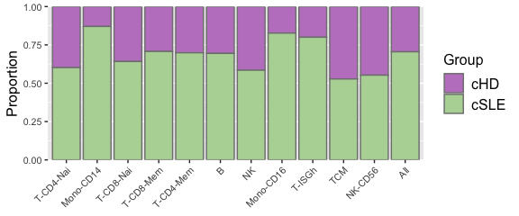

A quick guide to Ragas
================
Jinghua Gu, Uthra Balaji
11/08/2023

-   [1 Introduction](#1-introduction)
    -   [1.1 The post-integration (Pi)
        object](#11-the-post-integration-pi-object)
    -   [1.2 Create a Pi object](#12-create-a-pi-object)
-   [2 Analysis](#2-analysis)
    -   [2.1 Marker analysis and matrix
        plot](#21-marker-analysis-and-matrix-plot)
        -   [2.1.1 Wrapper for FindAllMarkers on a Pi
            object](#211-wrapper-for-findallmarkers-on-a-pi-object)
        -   [2.1.2 Matrix plot](#212-matrix-plot)
    -   [2.2 Pseudobulk analysis](#22-pseudobulk-analysis)
        -   [2.2.1 Calculate expression
            frequencies](#221-calculate-expression-frequencies)
        -   [2.2.2 Run pseudobulk
            analysis](#222-run-pseudobulk-analysis)
        -   [2.2.3 Visualize pseudobulk results with
            DSDotPlot](#223-visualize-pseudobulk-results-with-dsdotplot)
    -   [2.3 Proportion analysis](#23-proportion-analysis)
        -   [2.3.1 Pooled proportion plot](#231-pooled-proportion-plot)
        -   [2.3.2 Unpooled proportion
            plot](#232-unpooled-proportion-plot)
        -   [2.3.3 Notes on subcluster
            analysis](#233-notes-on-subcluster-analysis)
-   [3 Miscellaneous visualization](#3-miscellaneous-visualization)
    -   [3.1 Annotated dot plot](#31-annotated-dot-plot)
    -   [3.2 Stacked violin plot](#32-stacked-violin-plot)
    -   [3.3 Summarized heatmap](#33-summarized-heatmap)
    -   [3.4 Expression plot](#34-expression-plot)
-   [4 Data export](#4-data-export)

This is a tutorial for the Ragas package.

# 1 Introduction

## 1.1 The post-integration (Pi) object

First, load the Ragas package.

``` r
library(Ragas)
csle.pbmc.small
```

    ## An object of class Seurat 
    ## 1503 features across 3000 samples within 1 assay 
    ## Active assay: RNA (1503 features, 1501 variable features)
    ##  3 dimensional reductions calculated: pca, harmony, umap

The above Seurat object is one of the example objects from the Ragas
package, which is part of the scRNA-Seq data profiling PBMCs from
healthy (cHD) and SLE (cSLE) children
(<https://www.nature.com/articles/s41590-020-0743-0>). To perform Ragas
analysis, we need to create a post-integration (Pi) object based on the
Seurat object. A post-integration object is a single-cell data object
that have been normalized, batch integrated, and performed UMAP and
clustering analysis. Note: in our analysis, we used
[Harmony](https://portals.broadinstitute.org/harmony/articles/quickstart.html)
to perform batch integration. Run ? Pi to see more details regarding
data structure of the Pi object.

For demonstrative purpose, we have pre-built a Pi object called
“csle.pbmc.pi” based on the example Seurat object (csle.pbmc.small),
which is released with the Ragas package as part of the example data. To
return a summary of preprocessed data in csle.pbmc.pi, simply print the
object name in the R console:

``` r
csle.pbmc.pi
```

    ## An object of class Pi 
    ## 6 fields in the object: seurat.obj, exp.freq, markers, ds, cell.prop, parent.meta.data.
    ## The following fields have been processed:
    ##  seurat.obj: A Seurat object of 1503 features and 2901 cells.
    ##      1 assay: RNA, and 4 reductions: pca, harmony, umap, rp
    ##  exp.freq: A list of numeric matrices containing per gene expression frequencies
    ##      1 analysis run: 
    ##        ExpFreq|subcluster_idents|cutoff=0
    ##  markers: A list of data frames containing marker results.
    ##      1 analysis run: 
    ##        Markers|subcluster_idents|AllMarkers|test.use=wilcox
    ##  ds: A list of lists and data frames containing pseudobulk analysis results.
    ##      1 analysis run: 
    ##        DS|subcluster_idents|edgeR|group=Groups;sample=Names;gp1=cSLE;gp2=cHD;contrast=cSLE-cHD
    ##  cell.prop: A list of data frames containing cell proportion analysis results
    ##      1 analysis run: 
    ##        CellProp|subcluster_idents|unpooled|unpool_by_Names|group=Groups
    ## Metadata from the parent object provided? No 
    ## Subclusters integrated? Yes

A Pi object uses six fields to store analytical data. In the above
example, five out of the six Pi fields have been filled, including:

 (1) “seurat.obj”: a Seurat object<br>  (2) “exp.freq”: a PiData object
that stores per gene expression frequency per cluster. Run ? PiData for
more details<br>  (3) “markers”: a PiData object that stores FindMarkers
results for each cluster<br>  (4) “ds”: a PiData object that stores
differential state analysis results from pseudobulk analysis<br>  (5)
“cell.prop”: a PiData object that stores differential proportion
analysis results<br>

The “parent.meta.data” field is used to store metadata from the “parent”
of the current Seurat object in subcluster analysis. A PBMC object can
be a parent of multiple child objects, such as for B cell, T cell, and
monocyte. A B cell object can further be the parent of memory and naive
B cell objects. Since the PBMC object is at the top of the subcluster
hierarchy, no parent can be defined. Therefore, the “parent.meta.data”
field of the example Pi object is not set. See the [**Subclustering
Analysis
Vignette**](https://github.com/jig4003/Ragas.dev/blob/main/vignettes/subcluster.md)
for more formal explanation of parent and child objects in single-cell
subcluster analysis.

## 1.2 Create a Pi object

Now, let’s initialize a new Pi from scratch.

``` r
my.pbmc.pi <- CreatePostIntegrationObject(object = csle.pbmc.small)
```

    ## Post-integration object created

``` r
my.pbmc.pi
```

    ## An object of class Pi 
    ## 6 fields in the object: seurat.obj, exp.freq, markers, ds, cell.prop, parent.meta.data.
    ## The following field has been processed:
    ##  seurat.obj: A Seurat object of 1503 features and 3000 cells.
    ##      1 assay: RNA, and 3 reductions: pca, harmony, umap
    ## Metadata from the parent object provided? No 
    ## Subclusters integrated? No

The above code creates a “minimum” Pi object that only contains a Seurat
object. Note that in this case no data from subcluster analysis have
been integrated. If a user has additional objects from subcluster
analysis, one can follow the [**Subclustering Analysis
Vignette**](https://github.com/jig4003/Ragas.dev/blob/main/vignettes/subcluster.md)
to re-project refined subcluster identities to PBMC.

Once a Pi object has been created, one can first run UMAP and check
clusters of all the cells in the object.

``` r
RunDimPlot(object = my.pbmc.pi)
```

<!-- -->

The RunDimPlot function is simply a wrapper of the Seurat’s DimPlot
function with some small modifications, such as to use random colors to
code clusters. **By default, RunDimPlot and other Ragas functions assume
that the default cell identity is stored in the metadata column named
“seurat\_clusters”**. In case users want to pull and visualize a
different metadata column for cell identity (e.g., manually annotated
cell clusters or that re-projected from subcluster analysis), one can
change the cell identity by modifying the “group.by” or “ident” argument
of the corresponding functions. Now, let’s re-plot the UMAP and label
the clusters by manually annotated cluster names in a metadata column
called “cluster.annotation”.

``` r
RunDimPlot(object = my.pbmc.pi,
           group.by = "cluster.annotation")
```

<!-- -->

For the rest of this tutorial, we will use metadata “cluster.annotation”
to assign cluster identity and group cells.

# 2 Analysis

Ragas provides a user-friendly interface to integrate and visualize
several “house-keeping” single-cell analysis functions, including marker
analysis, differential state analysis using pseudobulk method, and
differential cell proportion analysis.

## 2.1 Marker analysis and matrix plot

### 2.1.1 Wrapper for FindAllMarkers on a Pi object

Users can call the FindAllMarkers function from Seurat by running the
wrapper function RunFindAllMarkers, which will store the marker results
in the Pi object for later visualization.

``` r
my.pbmc.pi <- RunFindAllMarkers(my.pbmc.pi,
                                ident = "cluster.annotation")
```

    ## Calculating cluster T-CD4-Nai

    ## Calculating cluster Mono-CD14

    ## Calculating cluster T-CD8-Nai

    ## Calculating cluster T-CD8-Mem

    ## Calculating cluster T-CD4-Mem

    ## Calculating cluster B

    ## Calculating cluster NK

    ## Calculating cluster Mono-CD16

    ## Calculating cluster T-ISGh

    ## Calculating cluster TCM

    ## Calculating cluster NK-CD56

``` r
my.pbmc.pi
```

    ## An object of class Pi 
    ## 6 fields in the object: seurat.obj, exp.freq, markers, ds, cell.prop, parent.meta.data.
    ## The following fields have been processed:
    ##  seurat.obj: A Seurat object of 1503 features and 3000 cells.
    ##      1 assay: RNA, and 3 reductions: pca, harmony, umap
    ##  markers: A list of data frames containing marker results.
    ##      1 analysis run: 
    ##        Markers|cluster.annotation|AllMarkers|test.use=wilcox
    ## Metadata from the parent object provided? No 
    ## Subclusters integrated? No

After running RunFindAllMarkers, a new data field called “markers” will
be added to the current Pi object, which contains results with a long,
unique identifier called
“Markers\|cluster.annotation\|AllMarkers\|test.use=wilcox”. This unique
identifier can be used to retrieve marker results. To take a closer look
at the new marker analysis results, one can access corresponding data
using “\[\[”.

``` r
my.pbmc.pi[["markers"]]
```

    ## 1 markers object(s):
    ##  + analysis 1 
    ##   A PiMarkerData object
    ##   3592 markers for 11 clusters
    ##   type: markers 
    ##   identity: cluster.annotation 
    ##   method: AllMarkers 
    ##   param: test.use=wilcox

### 2.1.2 Matrix plot

Once the marker analysis is done, the top markers from each cluster can
be plotted using matrix plot, inspired by Scanpy’s
[MatrixPlot](https://scanpy.readthedocs.io/en/stable/generated/scanpy.pl.matrixplot.html).

``` r
RunMatrixPlot(my.pbmc.pi,
              markers.key = "Markers|cluster.annotation|AllMarkers|test.use=wilcox", 
              column.anno.name.rot = 45, 
              heatmap.height = 6)
```

    ## Centering and scaling data matrix

<!-- -->

## 2.2 Pseudobulk analysis

Another important task in single-cell research is to identify
differentially expressed genes between conditions for each cluster,
which is also known as differential state (DS) analysis. We used
functions from the
[muscat](https://www.nature.com/articles/s41467-020-19894-4) package to
perform pseudobulk analysis for muti-sample multi-group scRNA-Seq
design.

### 2.2.1 Calculate expression frequencies

Before running pseudobulk analysis, we need to first perform expression
frequency analysis. Genes that are low expressers for a given cluster
will be filtered out in the final pseudobulk output.

``` r
my.pbmc.pi <- CalculateExpFreqs(my.pbmc.pi, 
                                ident = "cluster.annotation",
                                verbose = FALSE)
```

This will create a new object that contains the percentage of gene
expression for every gene per cluster under the “exp.freq” field of the
Pi object, which will be retrieved and used by the other functions
(e.g., DSDotPlot).

``` r
my.pbmc.pi
```

    ## An object of class Pi 
    ## 6 fields in the object: seurat.obj, exp.freq, markers, ds, cell.prop, parent.meta.data.
    ## The following fields have been processed:
    ##  seurat.obj: A Seurat object of 1503 features and 3000 cells.
    ##      1 assay: RNA, and 3 reductions: pca, harmony, umap
    ##  exp.freq: A list of numeric matrices containing per gene expression frequencies
    ##      1 analysis run: 
    ##        ExpFreq|cluster.annotation|cutoff=0
    ##  markers: A list of data frames containing marker results.
    ##      1 analysis run: 
    ##        Markers|cluster.annotation|AllMarkers|test.use=wilcox
    ## Metadata from the parent object provided? No 
    ## Subclusters integrated? No

### 2.2.2 Run pseudobulk analysis

To run pseudobulk analysis, simply run:

``` r
my.pbmc.pi <- RunPseudobulkAnalysis(object = my.pbmc.pi,
                                    ident.var = "cluster.annotation",
                                    group.var = "Groups",
                                    sample.var = "Names",
                                    group.1 = "cSLE",
                                    group.2 = "cHD")
```

    ## Checking validity of names...

    ## Contrast created: group_idcSLE-group_idcHD

    ## Creating single cell experiment object...

    ## Aggregating count data...

    ## Running differential state analysis...

    ## T-CD4-Nai..Mono-CD14..T-CD8-Nai..T-CD8-Mem..T-CD4-Mem..B..NK..Mono-CD16..T-ISGh..TCM..NK-CD56..

    ## 
    ## Formatting output...

    ## Pseudobulk-analysis completed!

``` r
my.pbmc.pi
```

    ## An object of class Pi 
    ## 6 fields in the object: seurat.obj, exp.freq, markers, ds, cell.prop, parent.meta.data.
    ## The following fields have been processed:
    ##  seurat.obj: A Seurat object of 1503 features and 3000 cells.
    ##      1 assay: RNA, and 3 reductions: pca, harmony, umap
    ##  exp.freq: A list of numeric matrices containing per gene expression frequencies
    ##      1 analysis run: 
    ##        ExpFreq|cluster.annotation|cutoff=0
    ##  markers: A list of data frames containing marker results.
    ##      1 analysis run: 
    ##        Markers|cluster.annotation|AllMarkers|test.use=wilcox
    ##  ds: A list of lists and data frames containing pseudobulk analysis results.
    ##      1 analysis run: 
    ##        DS|cluster.annotation|edgeR|group=Groups;sample=Names;gp1=cSLE;gp2=cHD;contrast=cSLE-cHD
    ## Metadata from the parent object provided? No 
    ## Subclusters integrated? No

A new data field called “ds” (differential state) is now added to the Pi
object.

### 2.2.3 Visualize pseudobulk results with DSDotPlot

We have developed a new type of dot plot called Differential State Dot
Plot (DSDotPlot) to visualize the fold change and statistical
significance of pseudobulk analysis for each cluster. Users need to
provide keys/identifiers to expression frequency data and pseudobulk
analysis results in the Pi object. By default, genes with an expression
frequency smaller than 10% will be filtered out to avoid visualizing
low, “background-like” expression, but this behavior can be modified by
changing the “exp.freq.filter” argument.

``` r
RunDSDotPlot(object = my.pbmc.pi,
             exp.freq.key = "ExpFreq|cluster.annotation|cutoff=0",
             ds.key = "DS|cluster.annotation|edgeR|group=Groups;sample=Names;gp1=cSLE;gp2=cHD;contrast=cSLE-cHD", 
             p.filter = 0.05,
             FC.filter = 4,
             to.adjust = TRUE
                    )
```

<!-- -->

## 2.3 Proportion analysis

Ragas also provides a rich set of functions to visualize cell proportion
data. There are two methods for proportion analysis: pooled and
unpooled. Pooled proportion analysis has been widely used in single-cell
research, while its main disadvantage is that we lose track of the
biological replicates by pooling all cells from all samples, which makes
it hard to evaluate the variability of cell proportions. Therefore, for
multi-sample multi-group designs, unpooled proportions are preferred.

### 2.3.1 Pooled proportion plot

When using the “pooled” plot, users can further choose one of the
following two methods to calculate proportion: either by “cluster” or by
“group”.

#### 2.3.1.1 by cluster

When “pooled.prop.by” is set to “cluster”, the cell proportion for a
given group in a given cluster is normalized by the total number of
cells in the corresponding cluster. In this case, for a particular
cluster, the cell proportions of different groups should always sum up
to 1.

``` r
RunProportionPlot(csle.pbmc.small, ## input can be a Seurat object
                  ident = "cluster.annotation",
                  group.by = "Groups",
                  method = "pooled",
                  pooled.prop.by = "cluster", ## default
                  axis.text.angle = 45,
                  axis.text.size = 8,
                  return.value = 'ggplot'
                  )
```

<!-- -->

If we exchange inputs for arguments “ident” and “group.by”, which will
lead to a different bar plot showing cell proportions for all clusters
normalized by the total number of cells in each group. This is
essentially a stacked version of pooling cell proportions “by group”
(see next section), except the bar plots are stacked.

``` r
my.pbmc.pi <- RunProportionPlot(my.pbmc.pi, ## if input is a Pi object, an updated Pi object will be the returned by default
                                ident = "Groups",
                                group.by = "cluster.annotation",
                                method = "pooled",
                                pooled.prop.by = "cluster", ## default
                                axis.text.size = 8)
```

<!-- -->

``` r
## A new data field called "cell.prop" will be added to the Pi object.
my.pbmc.pi 
```

    ## An object of class Pi 
    ## 6 fields in the object: seurat.obj, exp.freq, markers, ds, cell.prop, parent.meta.data.
    ## The following fields have been processed:
    ##  seurat.obj: A Seurat object of 1503 features and 3000 cells.
    ##      1 assay: RNA, and 3 reductions: pca, harmony, umap
    ##  exp.freq: A list of numeric matrices containing per gene expression frequencies
    ##      1 analysis run: 
    ##        ExpFreq|cluster.annotation|cutoff=0
    ##  markers: A list of data frames containing marker results.
    ##      1 analysis run: 
    ##        Markers|cluster.annotation|AllMarkers|test.use=wilcox
    ##  ds: A list of lists and data frames containing pseudobulk analysis results.
    ##      1 analysis run: 
    ##        DS|cluster.annotation|edgeR|group=Groups;sample=Names;gp1=cSLE;gp2=cHD;contrast=cSLE-cHD
    ##  cell.prop: A list of data frames containing cell proportion analysis results
    ##      1 analysis run: 
    ##        CellProp|Groups|pooled|group=cluster.annotation
    ## Metadata from the parent object provided? No 
    ## Subclusters integrated? No

#### 2.3.1.2 by group

In the alternative case, users can plot the cell proportions by group,
which means the cell counts for a given group in a given cluster are
normalized by the total number of cells for each group.

``` r
my.pbmc.pi <- RunProportionPlot(my.pbmc.pi,
                                ident = "cluster.annotation",
                                group.by = "Groups",
                                method = "pooled",
                                pooled.prop.by = "group",
                                axis.text.size = 8)
```

<!-- -->

``` r
my.pbmc.pi ## a second object added under cell.prop
```

    ## An object of class Pi 
    ## 6 fields in the object: seurat.obj, exp.freq, markers, ds, cell.prop, parent.meta.data.
    ## The following fields have been processed:
    ##  seurat.obj: A Seurat object of 1503 features and 3000 cells.
    ##      1 assay: RNA, and 3 reductions: pca, harmony, umap
    ##  exp.freq: A list of numeric matrices containing per gene expression frequencies
    ##      1 analysis run: 
    ##        ExpFreq|cluster.annotation|cutoff=0
    ##  markers: A list of data frames containing marker results.
    ##      1 analysis run: 
    ##        Markers|cluster.annotation|AllMarkers|test.use=wilcox
    ##  ds: A list of lists and data frames containing pseudobulk analysis results.
    ##      1 analysis run: 
    ##        DS|cluster.annotation|edgeR|group=Groups;sample=Names;gp1=cSLE;gp2=cHD;contrast=cSLE-cHD
    ##  cell.prop: A list of data frames containing cell proportion analysis results
    ##      2 analysis runs: 
    ##        CellProp|Groups|pooled|group=cluster.annotation
    ##        CellProp|cluster.annotation|pooled|group=Groups
    ## Metadata from the parent object provided? No 
    ## Subclusters integrated? No

### 2.3.2 Unpooled proportion plot

The unpooled proportion plot is suitable for multi-sample, multi-group
study design, which allows comparing average cell proportions between
groups of interest, as well as evaluating their variabilities within
each group.

#### 2.3.2.1 Unpooled boxplot

``` r
my.pbmc.pi <- RunProportionPlot(my.pbmc.pi,
                  ident = "cluster.annotation",
                  group.by = "Groups",
                  method = "unpooled",
                  unpool.by = "Names",
                  unpool.ncol = 3,
                  title.text.size = 6)
```

<!-- -->

#### 2.3.2.2 Unpooled barplot

``` r
my.pbmc.pi <- RunProportionPlot(my.pbmc.pi,
                                ident = "cluster.annotation",
                                group.by = "Groups",
                                method = "unpooled",
                                unpool.by = "Names",
                                unpool.plot.type = "barplot",
                                unpool.ncol = 3,
                                title.text.size = 6)
```

    ## PiData CellProp|cluster.annotation|unpooled|unpool_by_Names|group=Groups already exisits. Overwriting...

<!-- -->

### 2.3.3 Notes on subcluster analysis

In subcluster analysis, we often need to calculate multiple cell
proportions with respect to different “total cells”. For instance, for a
given T cell subpopulation, say Th1, we may be interested in its
proportional change within the total CD4 memory T cells, total CD4 T
cells, total T cells, or total PBMC. Each of the proportion normalized
by different total cells represent a valid biological hypothesis and
Ragas gives users the flexibility to calculate different cell
proportions by changing parental objects. Please go to the
[**Subclustering Analysis
Vignette**](https://github.com/jig4003/Ragas.dev/blob/main/vignettes/subcluster.md)
for more a detailed example.

# 3 Miscellaneous visualization

Single-cell researchers often want to investigate the data with a set of
their own markers. This can be achieved by running dot plots, violin
plots, and heatmaps, etc.

## 3.1 Annotated dot plot

In Ragas, we re-developed the original
[DotPlot](https://satijalab.org/seurat/reference/dotplot) function from
Seurat by adding several useful new features, including feature
annotation and identity clustering. By default, random colors will be
generated for feature annotations, but users are allowed to assign their
customized colors.

``` r
my.list <- list(Monocytes = c("CD14","FCGR3A"),
                B = "MS4A1",
                T = c("CCR7", "CD8A"),
                NK = "NKG7")
RunAnnotatedDotPlot(object = my.pbmc.pi,
                    annotations = my.list,
                    annotation.cols = c( 'Monocytes'= 'tomato', 'B' = 'seagreen', 'T' = 'steelblue', 'NK' = 'purple'),
                    group.by = "cluster.annotation")
```

<!-- -->

## 3.2 Stacked violin plot

Another useful function to visualize expression levels of a set of
features across clusters is the stacked violin plot.

``` r
RunStackedVlnPlot(my.pbmc.pi,
                  ident = "cluster.annotation",
                  features = my.list,
                  color.by = "mean.exp",
                  column.names.rotation = 90)
```

<!-- -->

There are multiple ways to code the colors for the violins by setting
the “color.by” to one of the following: “features”, “clusters”,
“median.exp”, “mean.exp”, “split.var”. We can also split the violin plot
based on a grouping variable. This can be accomplished by setting the
“split.by” argument to the name of the metadata column one wish to split
the violins by. Note: when “split.by” is set, the “color.by” argument
must be set to “split.var”.

``` r
RunStackedVlnPlot(my.pbmc.pi,
                  ident = "cluster.annotation",
                  features = my.list,
                  split.by = "Groups",
                  color.by = "split.var",
                  column.names.rotation = 45)
```

<!-- -->

## 3.3 Summarized heatmap

Summarized heatmap is another effective way to visualize user-defined
markers across clusters. The “split.by” argument also controls
separating plots for each cluster based on a second variable, such as
disease group or gender.

``` r
features <- list("T cell" = c("CD8A", "CD8B"),
                ISG = c("ISG15","ISG20","IFI44L", "IFI6", "MX1"),
                "Housekeeping" = c("ACTB"))
RunSummarizedHeatmap(object = my.pbmc.pi,
                     ident = "cluster.annotation",
                     features = features,
                     split.by = "Groups", 
                     column.names.rotation = 30,
                     heatmap.width = 20)
```

<!-- -->

When needed, users may use the argument “additional.metadata” to add
additional metadata columns to color-code columns, as long as the
“split.by” argument and “additional.metadata” are compatible. For
example, if “split.by” is set to “Groups” (cHD or cSLE), we can no
longer set “additional.metadata” to columns such as “Age” or “Gender”
because subjects from either the SLE group or the healthy group can have
different age or gender, making the column annotation ambiguous. If we
set “split.by” to “Names” (i.e., sample name), we can simultaneously add
other metadata such as “Groups” and “Gender” for column annotation.

``` r
RunSummarizedHeatmap(object = my.pbmc.pi,
                     ident = "cluster.annotation",
                     features = features,
                     split.by = "Names", ## sample name
                     additional.metadata = c("Groups", "Gender"),
                     heatmap.width = 60,
                     heatmap.height = 15,
                     show.column.names = FALSE)
```

<!-- -->

## 3.4 Expression plot

Per cluster single cell gene expression data can be visualized using the
expression plot.

``` r
RunExpressionPlot(object = my.pbmc.pi,
                  feature = "ISG15",
                  ident = "cluster.annotation",
                  group.by = "Names",
                  split.by = "Groups")
```

<!-- -->

# 4 Data export

In Ragas, we provide the ExportPiData function to export analysis
results to .csv file(s) using analysis keys from the Pi object. An
example to export pseudobulk analysis results is given below.

``` r
ExportPiData(object = csle.pbmc.pi,
             field = 'ds',
             key = 'DS|subcluster_idents|edgeR|group=Groups;sample=Names;gp1=cSLE;gp2=cHD;contrast=cSLE-cHD',
             file.prefix = 'pbmc.ds' ## A mandatory argument. User should provide an informative prefix (e.g., "csle.pbmc") for exported data
)
```
