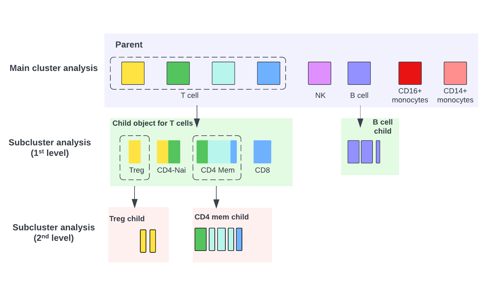
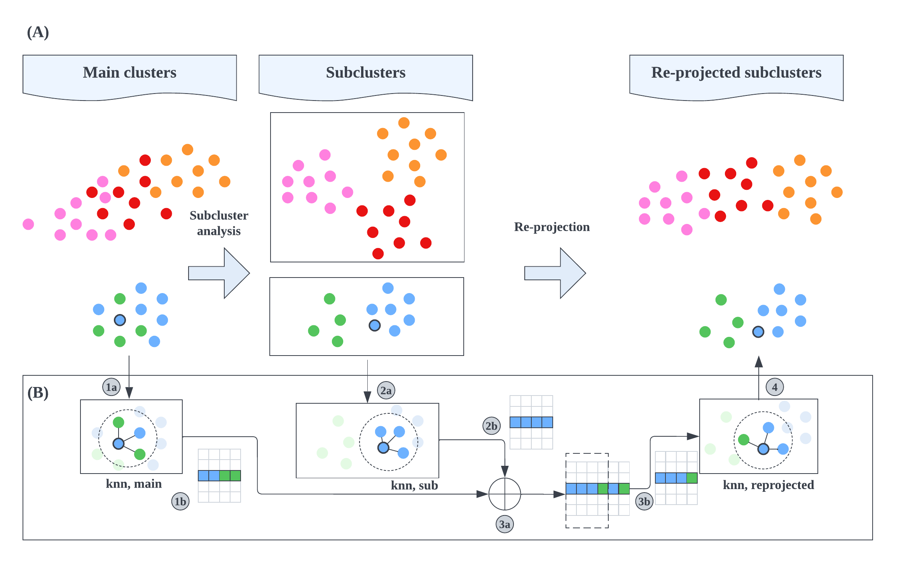

```{r setup, include=FALSE}
knitr::opts_chunk$set(echo = TRUE)
```

# Introduction
## Why subcluster analysis?
One of the unique challenges in single cell data analysis is to accurately determine cell identities. A common starting place is to follow the "guided clustering" procedure, such as that described by [Seurat](https://satijalab.org/seurat/articles/pbmc3k_tutorial.html). The key steps of guided clustering typically involves data normalization, variable feature selection, principal component analysis (PCA), followed by clustering and UMAP analysis for visualization.The guided clustering is a promising technique for single cell identification,  which can effectively cluster cells by their corresponding cell types: e.g., group cells from total peripheral blood mononuclear cells (PBMCs) into B cells, monocytes and DCs, T cell and NK cells, etc.

Although deemed useful by many studies, a critical limitation of the the aforementioned guided-clustering procedure is that it lacks accuracy when identifying subpopulations that have similar expressions. In other words, it is much easier to separate main immune cell populations (e.g., B, T, and monocytes) from total PBMCs, than to further segregate different subsets of an immune cell (e.g., effector, helper, and regulatory T cells) by "one-shot" application of the guided clustering procedure at the PBMC level. This is because the variable features and principal component (PCs) selected at the PBMC level largely reflect differences between major immune cell types, yet they often under-represent the variability within each immune cell subsets.

One simple yet effective remedy to increase the resolution and accuracy of single cell clustering is to perform a second round of refined clustering on a subset of cells, e.g.,T cells from PBMCs, so that different T cell subpopulations can be better identified. The subclustering analysis is almost identical to the aforementioned guided-clustering procedure, yet the **variable features** and **PCs** from subclustering represent the strongest transcriptional differences among the cells in the selected clusters. Subcluster analysis has the following main advantages:

* **Improved identity**
With improved feature selection that is more specific to a subset of cells/clusters, subclustering analysis can significantly improve cell identity assignment, especially within more homogeneous subpopulations.

* **Increased resolution**
Users are allowed to use different clustering resolutions for a given subset of cells, which provides great flexibility compared to the standard guided clustering that typically has one resolution parameter to control the number of clusters.

* **Removal of noisy clusters** An added benefit for subclustering analysis is that "noisy" clusters, such as doublets and cells with low quality (e.g., high mitochondrial expression and low RNA) may emerge as isolated clusters on the UMAP, which can be removed before downstream analysis.

A few challenges/pitfalls exist for subclustering analysis. When subclusters were generated from multiple cell compartments, they are often interpreted and visualized separately. There is no effective method to combine results from all subclusters for systemic visualization and investigation. Also, when analyzing each cell compartment separately, it is often very important to keep track of data from the main clusters so as to avoid bias of interpretation in downstream analysis. A good example is cell proportion analysis for subcluster analysis, which will be explained in details later.

## Example data

In this tutorial, we will demonstrate steps of streamlined single cell subclustering analysis and visualization using the example data "csle.pbmc.small" from the Ragas package. As one can see from the following UMAPs, the initial clustering at the PBMC level that we refer to as the "main cluster analysis" effectively delineates several major immune cell populations (monocyte, T cell, B cell, NK). However, cell identities for immune subpopulations are not so well-defined. For instance, part of the CD8 memory cluster express SLC4A10, a very specific marker for mucosal-associated invariant T (MAIT) cells. Also,a portion of the CD4 memory T cells express FOXP3, which is a marker for regulatory T cells (Tregs) with suppressive functions. Only one B cell cluster is identified at the PBMC level, which can be clearly separated into naive (TCL1A-high) and memory B cells (TCL1A-low). Moreover, known B cell subpopulation, such as CD27+ memory B cells and IgD-CD27- double-negative (DN2, TBX21-high) B cells completely overlap with each other on the UMAP, leaving the B cell compartment poorly-characterized. 

```{r, fig.width = 12,fig.height = 6}
library(Ragas)
library(Nebulosa)
p1 <- RunDimPlot(object = csle.pbmc.small,
           group.by = "cluster.annotation") + ggtitle("PBMC")

p2 <- plot_density(csle.pbmc.small, c("SLC4A10")) ## MAIT
p3 <- plot_density(csle.pbmc.small, c("FOXP3")) ## Treg

p4 <- plot_density(csle.pbmc.small, c("TCL1A", "MS4A1"), joint = TRUE, combine = FALSE, reduction = "umap")[[3]] ## Naive B cell
p5 <- plot_density(csle.pbmc.small, c("CD27", "MS4A1"), joint = TRUE, combine = FALSE, reduction = "umap")[[3]] ## Memory B cell
p6 <- plot_density(csle.pbmc.small, c("TBX21", "MS4A1"), joint = TRUE, combine = FALSE, reduction = "umap")[[3]] ## DN2
(p1 | p2 | p3) / (p4 | p5 | p6)
```


## Hierarchy and nomenclature for subcluster analysis
One way to improve the definition of immune subpopulations is to perform subcluster analysis. Before we go any further, we need to briefly explain the terminology related to subcluster analysis:

+ _main cluster analysis_
&ensp;Refers to the very top-level guided clustering analysis on the total cells from a dataset
+ _subcluster analysis_
&ensp;Refers to re-analysis of a subset of cells from main clusters analysis, or another subcluster analysis (i.e., multi-level subcluster analysis)
+ _parent_
&ensp;A parent refers to data from which a subset of cells are selected and go through subcluster analysis. 
+ _child_
&ensp;As opposed to parent, refers to a subset of cells from the parent object that undergo subcluster analysis. 

Data/objects from the main cluster analysis can only be a parent, while data/objects from the subcluster analysis can be both a child of the main cluster analysis or a parent of another subcluster analysis in a multi-level setting.

**Figure 1. A typical work flow of single-cell subcluster analysis**
```{r parent-child, echo=FALSE, out.width = '100%'}

```

Figure 1 gives a schematic overview of the structure of a multi-level single-cell subcluster analysis on the example PBMC data. For the top-level main cluster analysis, several main immune clusters are identified. One could proceed by grouping and subsetting cells from similar clusters for further subcluster analysis. In this example, we group and subset clusters from T and B cells for subcluster analysis. The monocyte and natural killer (NK) clusters are kept as-is without any re-clustering. Data and objects from the main clustering analysis are referred to as the "parent" to two "child" objects: a T cell child object and a B cell child object.

The subcluster analysis (1st level) re-clustered T and B child objects into refined subclusters. A second round of subclustering is deemed necessary if users wish to further subset and re-cluster cells from these compartments (e.g., Treg and CD4+ memory T cells) to further characterize immune subpopulation within them. In this case, the T cell subcluster object, a child object of the total PBMC, is now the parent of Treg and CD4 memory subcluster objects.

# Integrate and visualize subclusters

## Before integration
We will illustrate integration and visualization of subcluster analysis using Ragas with the pediatric lupus example data. In alignment with the previous work flow figure, two rounds of subcluster analysis will be performed:  we will first re-analyze T cells and B cells to improve the characterization of major T and B subpopulations followed by a second round of analysis of Tregs and memory CD4 T cells. All analyses, including cell subsetting and re-performing feature selection, PCA, batch integration, UMAP and clustering have been already completed and saved into the following Seurat objects:
```{r}
csle.bcell.small
csle.tcell.small
csle.treg.small
csle.cd4.mem.small
```

Let's first check the new UMAPs and clusters for each individual subclustered object. For total T cells, a few new subclusters emerge after subcluster analysis, including MAIT (SLC4A10), Treg (FOXP3), a mixture cluster of CD8 T cells and gdT, and an ISG-high cluster. 
```{r, fig.width = 12,fig.height = 3}
p1 <- RunDimPlot(csle.tcell.small, group.by = "cluster.annotation") + ggtitle("T cell subclusters")
p2 <- plot_density(csle.tcell.small, c("SLC4A10")) ## MAIT
p3 <- plot_density(csle.tcell.small, c("FOXP3")) ## Treg
(p1 | p2 | p3)
```

Now if we look into the Treg and CD4 memory objects, we will see further refinement of CD4 T regulatory and helper subsets, including naive (CCR7) and memory (S100A4) Treg subsets, central memory T cells (TCM, CCR7), T helper cell populations, including Th1 (GZMK), Th2 (IL17RB), Th17(CTSH), and Th22 (CCR10).

(Note: due to limited cell number in this example dataset, we have to leverage between a marker's specificity and its level of expression when choosing T subset markers for illustration. For instance, expression of PTGTR2 and GATA3-AS1, two of the most specific markers for Th2, are too sparse to be visualized on this small example dataset, so another Th2 marker IL17RB is used instead.)  
```{r, fig.width = 12,fig.height = 3}
## Treg
p1 <- RunDimPlot(csle.treg.small, group.by = "cluster.annotation") + ggtitle("Treg subclusters")
p2 <- plot_density(csle.treg.small, c("CCR7")) ## Treg naive
p3 <- plot_density(csle.treg.small, c("S100A4")) ## Treg memory
(p1 | p2 | p3)
```

```{r, fig.width = 12,fig.height = 6}
## Memory CD4+
p1 <- RunDimPlot(csle.cd4.mem.small, group.by = "cluster.annotation") + ggtitle("CD4+ memory subclusters")
p2 <- plot_density(csle.cd4.mem.small, c("CCR7")) ## TCM
p3 <- plot_density(csle.cd4.mem.small, c("GZMK")) ## Th1
p4 <- plot_density(csle.cd4.mem.small, c("IL17RB")) ## Th2
p5 <- plot_density(csle.cd4.mem.small, c("CTSH")) ## Th17
p6 <- plot_density(csle.cd4.mem.small, c("CCR10")) ## Th22

(p1 | p2 | p3) / (p4 | p5 | p6) 
```

Similarly for B cells, subcluster analysis revealed three known B cell subpopulations: naive, memory, and DN2.

```{r, fig.width = 8,fig.height = 6}
p1 <- RunDimPlot(object = csle.bcell.small,
           group.by = "cluster.annotation") + ggtitle("PBMC")
p2 <- plot_density(csle.bcell.small, c("TCL1A", "MS4A1"), joint = TRUE, combine = FALSE, reduction = "umap")[[3]] ## Naive B cell
p3 <- plot_density(csle.bcell.small, c("CD27", "MS4A1"), joint = TRUE, combine = FALSE, reduction = "umap")[[3]] ## Memory B cell
p4 <- plot_density(csle.bcell.small, c("TBX21", "MS4A1"), joint = TRUE, combine = FALSE, reduction = "umap")[[3]] ## DN2
(p1 | p2) / (p3 | p4)
```

## Subcluster integration/re-projection
As demonstrated above, subcluster analysis can effectively improve cell identity characterization. Once the subcluster analysis is done, one can proceed with downstream analysis on those particular subclusters separately (e.g., perform all analysis on total B cells, independently from any other clusters). However, we often need to look at all cells/clusters together to study their similarities and differences, or even to draw links between different cell subpopulations to further study their cell-cell communications. Therefore, it will be important to integrate all subcluster objects back to the main cluster level. In Ragas, such "backward-integration" is realized through "re-projection". Figure 2 gives a graphical illustration of the re-projection function. 

**Figure 2. Ragas re-projects subclusters by combining nearest-neighbor graphs**
```{r, echo=FALSE, out.width = '90%'}

```


In Figure 2, we demonstrate how UMAPs from the main cluster and subclutser analysis are combined by re-projection. The re-projected UMAP has the advantage of inheriting the refined local cell embeddings from subcluster analysis while at the same time reserve the skeleton connecting the major cell types from the main cluster analysis. Figure 2 also illustrates the work flow of the re-projection algorithm. For a given cell from the main cluster analysis (circled black), its K-nearest neighbor (KNN) graph (1a, K = 4) is calculated, which is represented by and stored in a matrix object (1b). Similarly, the nearest neighbor graph is calculated for the same cell at the subcluster level (2a-b). In step 3a, the nearest neighbor graphs from both main cluster analysis and subcluster analysis are merged and all neighbors are ordered by their distances. Only top K neighbors are kept to make the combined KNN graph (3b). Finally, these steps are performed in parallel for all cells to build the KNN and make the re-projected UMAP.

## Single-level re-projection: integrate B cells
To integrate UMAPs from main clusters and subclusters to generate the re-projected UMAP, simply run Ragas function "CreatePostIntegrationObject" and assign the argument "child.object.list" to a named list containing child Seurat objects for subcluster analysis. The names of the list should be self-explanatory (such as "Bcell") since it will be used to identify the subclusters in downstream analysis. When applicable, cluster annotation of the parent or child object can be passed by the "rp.main.cluster.anno" or "rp.subcluster.colname" argument, respectively, so as to improve readability of cluster identities; otherwise, numeric cluster IDs stored in the "seurat_clusters" metadata column will be used by default. Below is a simple example illustrating a **single-level** re-projection to integrate B cell subclusters with the total PBMC object.

```{r}
subclusters <- list("Bcell" = "csle.bcell.small")
my.pbmc.pi <- CreatePostIntegrationObject(object = csle.pbmc.small,
                                           child.object.list = subclusters, 
                                           rp.main.cluster.anno = "cluster.annotation",
                                           rp.subcluster.colname = "cluster.annotation")
```

(Note: The CreatePostIntegrationObject function will create the post-integration (Pi) object, which is simply a list of collected data objects organized in an orchestrated way for single-cell analysis and visualization, including the batch-integrated Seurat object and fields to store additional analysis results. Run ? CreatePostIntegrationObject to see more details about the Pi object.)

By default, the re-projected UMAP can be accessed by the reduction name "rp". The new cluster names are stored in a metadata column called "subcluster_idents".
```{r, fig.width = 6,fig.height = 4}
RunDimPlot(my.pbmc.pi, 
           reduction = "rp", 
           group.by = "subcluster_idents")
```

In the new re-projected PBMC UMAP, the three B cell subsets are clearly delineated while cells from the rest of the clusters remain the same. 

## Multi-level re-projection: integrate B and T cell subsets
Often times we need to integrate several subcluster objects from different levels, such as to combine all immune subsets from Tregs, CD4 memory T cells, other T cells, and B cell subclusters with total PBMCs. We show an example of such **multi-level** re-projection using the same pediatric SLE example data. The order of re-projections in a multi-level setting goes backwards, where the bottom level subcluster analysis (2nd level, Tregs and memory CD4) will be re-projected to total T cells first, followed by re-projection of the top level subclusters (1st level, T cell and B cell) to PBMCs.
```{r, fig.width = 7,fig.height = 5}
## step 1 (2nd level subclusters): T cell re-projection
subclusters <- list("CD4mem" = "csle.cd4.mem.small", 
                    "Treg" = "csle.treg.small")
my.tcell.pi <- CreatePostIntegrationObject(object = csle.tcell.small, 
                                           child.object.list = subclusters, 
                                           rp.main.cluster.anno = "cluster.annotation",
                                           rp.subcluster.colname = "cluster.annotation",
                                           parent.object = csle.pbmc.small) ## optional: link the t cell object with its PBMC parent

## step 2 (1st level subclusters): PBMC re-projection
subclusters <- list("B cell" = "csle.bcell.small", 
                    "T cell" = "my.tcell.pi")
sc.config <- ConfigureReprojection(type = "sc", "B cell")
sc.config <- ConfigureReprojection(type = "sc", "T cell", umap.name = "rp", append.to = sc.config)
sc.colnames <- c("B cell" = "cluster.annotation", "T cell" = "subcluster_idents")

my.pbmc.pi <- CreatePostIntegrationObject(object = csle.pbmc.small,
                                          child.object.list = subclusters,
                                          rp.subcluster.umap.config = sc.config,
                                          rp.main.cluster.anno = "cluster.annotation", 
                                          rp.subcluster.colname = sc.colnames)

RunDimPlot(my.pbmc.pi, 
           reduction = "rp", 
           group.by = "subcluster_idents")

```

Now, markers for immune subpopulations (e.g., both B cell and T cell subsets) are clearly separated out from each other on the new UMAP object ("rp"). 
```{r, fig.width = 15,fig.height = 7}
csle.pbmc.rp <- my.pbmc.pi[["seurat.obj"]] ## get the updated Seurat object with re-projected UMAP
p1 <- plot_density(csle.pbmc.rp, c("TCL1A", "MS4A1"), joint = TRUE, combine = FALSE, reduction = "rp")[[3]] + ggtitle("Naive B (TCL1A)") 
p2 <- plot_density(csle.pbmc.rp, c("CD27", "MS4A1"), joint = TRUE, combine = FALSE, reduction = "rp")[[3]] + ggtitle("Memory B (CD27)") 
p3 <- plot_density(csle.pbmc.rp, c("TBX21", "MS4A1"), joint = TRUE, combine = FALSE, reduction = "rp")[[3]] + ggtitle("DN2 (CD27)") 

p4 <- plot_density(csle.pbmc.rp, c("FOXP3"),reduction = "rp") + ggtitle("Treg (FOXP3)") 
p5 <- plot_density(csle.pbmc.rp, c("SLC4A10", "CD3D"), joint = TRUE, combine = FALSE, reduction = "rp")[[3]] + ggtitle("MAIT (SLC4A10, CD3D)") 
p6 <- plot_density(csle.pbmc.rp, c("GZMK", "CD4"), joint = TRUE, combine = FALSE, reduction = "rp")[[3]] + ggtitle("Th1 (GZMK, CD4)") 

(p1 | p2 | p3) / (p4 | p5 | p6)
```

# Notes on cell proportion analysis

In subcluster analysis, we often need to calculate multiple cell proportions with respect to different "total cells". For instance, we may be interested in comparing cell proportion changes of the memory CD4 T helper cells between SLE and healthy within total memory CD4 T cells, total T cells, or total PBMCs. Each of the cell proportion normalized by different total cells represents a valid biological hypothesis and Ragas offers users the flexibility to calculate cell proportions simply by changing parental objects. To demonstrate this, let's make a Pi object from the example CD4 memory data.
```{r}
my.cd4.pi.1 <- CreatePostIntegrationObject(csle.cd4.mem.small)
my.cd4.pi.1
```
This Pi object does not have metadata from any parent object so cell proportions will be calculated with respect to total CD4 memory T cells. To compare and plot changes in cell proportions, run the following code:
```{r, fig.width = 6,fig.height = 2}
my.cd4.pi.1 <- RunProportionPlot(my.cd4.pi.1,
                                ident = "cluster.annotation",
                                group.by = "Groups",
                                method = "unpooled",
                                unpool.by = "Names",
                                use.parent.as.ref = FALSE,
                                unpool.ncol = 5,
                                title.text.size = 8)
```

If one wish to compare CD4 memory helper cell proportions with respect to total T cell, simply assign parent object to the total T cell object "csle.tcell.small".
```{r}
csle.tcell.small
my.cd4.pi.2 <- CreatePostIntegrationObject(csle.cd4.mem.small,
                                           parent.object = csle.tcell.small)
my.cd4.pi.2
```

Now that the metadata from the parent object "csle.tcell.small" has been integrated into the Pi object, we can re-perform proportion analysis by setting "use.parent.as.ref" to TRUE.
```{r, fig.width = 6,fig.height = 2}
my.cd4.pi.2 <- RunProportionPlot(my.cd4.pi.2,
                                ident = "cluster.annotation",
                                group.by = "Groups",
                                method = "unpooled",
                                unpool.by = "Names",
                                use.parent.as.ref = TRUE,
                                unpool.ncol = 5,
                                title.text.size = 8)
```

Further, we can add in the metadata from the PBMC object so the relative cell proportions of CD4 memory subsets with respect to total PBMCs can be compared. There are two ways to do this: (1) create a new Pi object from scratch like we did earlier, or (2) add the metadata of the PBMC object to the current Pi object. The second way can be achieved as follows.
```{r}
pm <- PiParentMetaData(data = csle.pbmc.small[[]],
                       parent.name = "csle.pbmc.small") ## Create a PiData object for parent metadata
pm
CheckPiData(pm, csle.cd4.mem.small) ## Will print nothing if check is successful
```
```{r}
my.cd4.pi.3 <- AddPiData(my.cd4.pi.2, pm)
my.cd4.pi.3
```
In this way, metadata from both total PBMCs and total T cells will be stored in the parent.meta.data field. Now, we can analyze memory T cell proportion changes in total PBMCs. 
```{r, fig.width = 6,fig.height = 2}
my.cd4.pi.3 <- RunProportionPlot(my.cd4.pi.3,
                                ident = "cluster.annotation",
                                parent.meta.data.key = "ParentMetaData|parent=csle.pbmc.small",
                                group.by = "Groups",
                                method = "unpooled",
                                unpool.by = "Names",
                                use.parent.as.ref = TRUE,
                                unpool.ncol = 5,
                                title.text.size = 8)
```

Comparing the above three separate analyses, one can see that CD4 memory T cells show a trend of reduced cell proportions in SLE patients ("lymphopenia") and the difference in TCM is statistically significant, which is less represented when comparing cells within the CD4 memory compartment.

