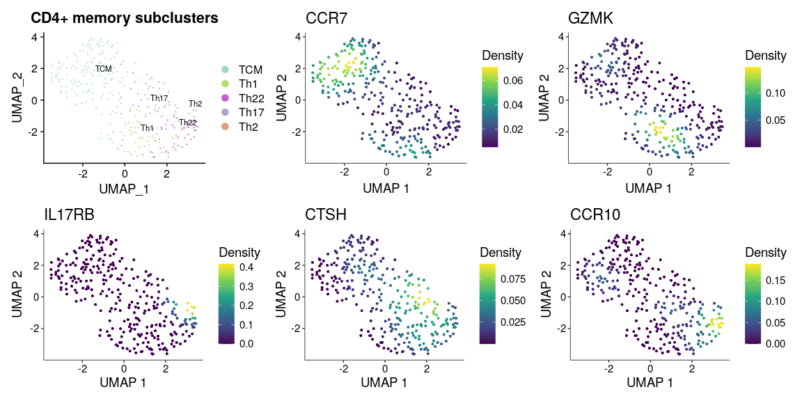
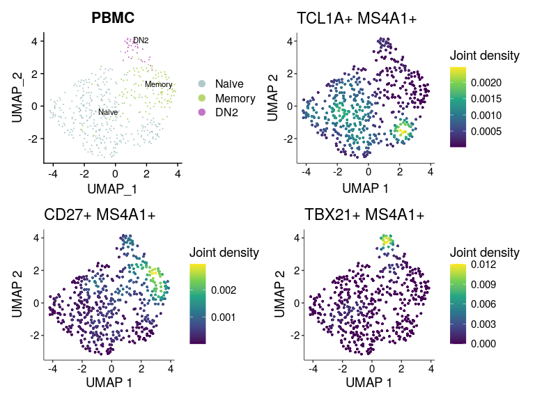
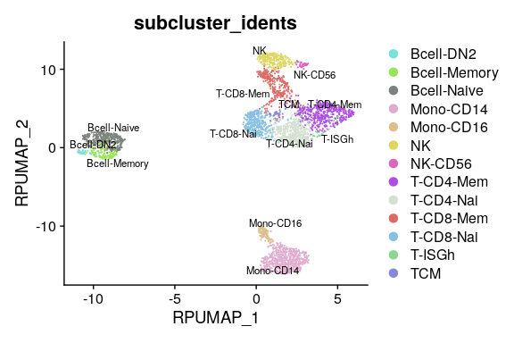
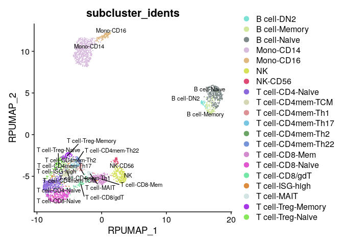
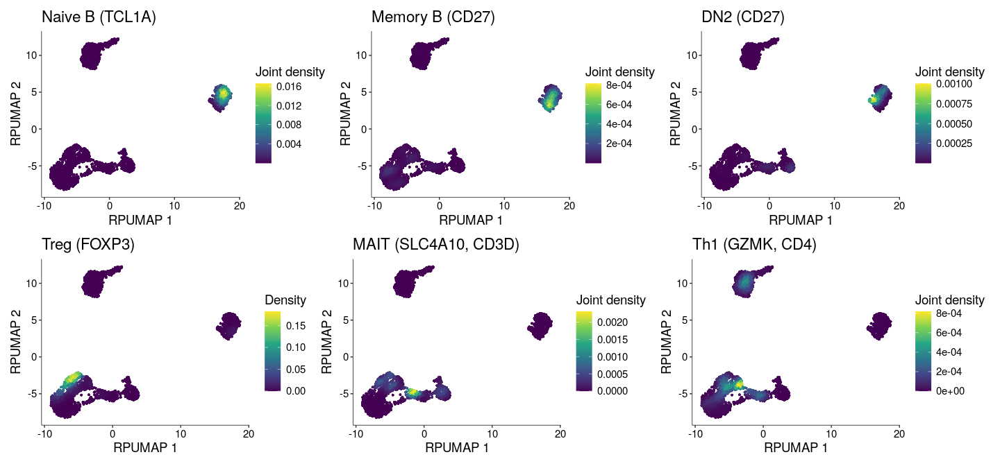
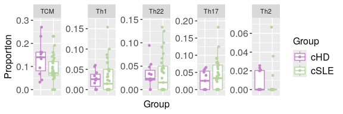
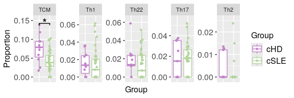

Ragas subcluster re-projection vignette
================
Jinghua Gu, Uthra Balaji
11/08/2023

- [1 Introduction](#1-introduction)
  - [1.1 Why subcluster analysis?](#11-why-subcluster-analysis)
  - [1.2 Example data](#12-example-data)
  - [1.3 Hierarchy and nomenclature for subcluster
    analysis](#13-hierarchy-and-nomenclature-for-subcluster-analysis)
- [2 Integrate and visualize
  subclusters](#2-integrate-and-visualize-subclusters)
  - [2.1 Before integration](#21-before-integration)
  - [2.2 Subcluster
    integration/re-projection](#22-subcluster-integrationre-projection)
  - [2.3 Single-level re-projection: integrate B
    cells](#23-single-level-re-projection-integrate-b-cells)
  - [2.4 Multi-level re-projection: integrate B and T cell
    subsets](#24-multi-level-re-projection-integrate-b-and-t-cell-subsets)
- [3 Notes on cell proportion
  analysis](#3-notes-on-cell-proportion-analysis)

# 1 Introduction

## 1.1 Why subcluster analysis?

One of the unique challenges in single cell data analysis is to
accurately determine cell identities. A common starting place is to
follow the “guided clustering” procedure, such as that described by
[Seurat](https://satijalab.org/seurat/articles/pbmc3k_tutorial.html).
The key steps of guided clustering typically involves data
normalization, variable feature selection, principal component analysis
(PCA), followed by clustering and UMAP analysis for visualization.The
guided clustering is a promising technique for single cell
identification, which can effectively cluster cells by their
corresponding cell types: e.g., group cells from total peripheral blood
mononuclear cells (PBMCs) into B cells, monocytes and DCs, T cell and NK
cells, etc.

Although deemed useful by many studies, a critical limitation of the the
aforementioned guided-clustering procedure is that it lacks accuracy
when identifying subpopulations that have similar expressions. In other
words, it is much easier to separate main immune cell populations (e.g.,
B, T, and monocytes) from total PBMCs, than to further segregate
different subsets of an immune cell (e.g., effector, helper, and
regulatory T cells) by “one-shot” application of the guided clustering
procedure at the PBMC level. This is because the variable features and
principal component (PCs) selected at the PBMC level largely reflect
differences between major immune cell types, yet they often
under-represent the variability within each immune cell subsets.

One simple yet effective remedy to increase the resolution and accuracy
of single cell clustering is to perform a second round of refined
clustering on a subset of cells, e.g.,T cells from PBMCs, so that
different T cell subpopulations can be better identified. The
subclustering analysis is almost identical to the aforementioned
guided-clustering procedure, yet the **variable features** and **PCs**
from subclustering represent the strongest transcriptional differences
among the cells in the selected clusters. Subcluster analysis has the
following main advantages:

- **Improved identity** With improved feature selection that is more
  specific to a subset of cells/clusters, subclustering analysis can
  significantly improve cell identity assignment, especially within more
  homogeneous subpopulations.

- **Increased resolution** Users are allowed to use different clustering
  resolutions for a given subset of cells, which provides great
  flexibility compared to the standard guided clustering that typically
  has one resolution parameter to control the number of clusters.

- **Removal of noisy clusters** An added benefit for subclustering
  analysis is that “noisy” clusters, such as doublets and cells with low
  quality (e.g., high mitochondrial expression and low RNA) may emerge
  as isolated clusters on the UMAP, which can be removed before
  downstream analysis.

A few challenges/pitfalls exist for subclustering analysis. When
subclusters were generated from multiple cell compartments, they are
often interpreted and visualized separately. There is no effective
method to combine results from all subclusters for systemic
visualization and investigation. Also, when analyzing each cell
compartment separately, it is often very important to keep track of data
from the main clusters so as to avoid bias of interpretation in
downstream analysis. A good example is cell proportion analysis for
subcluster analysis, which will be explained in details later.

## 1.2 Example data

In this tutorial, we will demonstrate steps of streamlined single cell
subclustering analysis and visualization using the example data
“csle.pbmc.small” from the Ragas package. As one can see from the
following UMAPs, the initial clustering at the PBMC level that we refer
to as the “main cluster analysis” effectively delineates several major
immune cell populations (monocyte, T cell, B cell, NK). However, cell
identities for immune subpopulations are not so well-defined. For
instance, part of the CD8 memory cluster express SLC4A10, a very
specific marker for mucosal-associated invariant T (MAIT) cells. Also,a
portion of the CD4 memory T cells express FOXP3, which is a marker for
regulatory T cells (Tregs) with suppressive functions. Only one B cell
cluster is identified at the PBMC level, which can be clearly separated
into naive (TCL1A-high) and memory B cells (TCL1A-low). Moreover, known
B cell subpopulation, such as CD27+ memory B cells and IgD-CD27-
double-negative (DN2, TBX21-high) B cells completely overlap with each
other on the UMAP, leaving the B cell compartment poorly-characterized.

``` r
library(Ragas)
library(Nebulosa)
```

    ## Warning: package 'Nebulosa' was built under R version 4.3.2

    ## Loading required package: ggplot2

    ## Loading required package: patchwork

``` r
p1 <- RunDimPlot(object = csle.pbmc.small,
           group.by = "cluster.annotation") + ggtitle("PBMC")

p2 <- plot_density(csle.pbmc.small, c("SLC4A10")) ## MAIT
p3 <- plot_density(csle.pbmc.small, c("FOXP3")) ## Treg

p4 <- plot_density(csle.pbmc.small, c("TCL1A", "MS4A1"), joint = TRUE, combine = FALSE, reduction = "umap")[[3]] ## Naive B cell
p5 <- plot_density(csle.pbmc.small, c("CD27", "MS4A1"), joint = TRUE, combine = FALSE, reduction = "umap")[[3]] ## Memory B cell
p6 <- plot_density(csle.pbmc.small, c("TBX21", "MS4A1"), joint = TRUE, combine = FALSE, reduction = "umap")[[3]] ## DN2
(p1 | p2 | p3) / (p4 | p5 | p6)
```

<!-- -->

## 1.3 Hierarchy and nomenclature for subcluster analysis

One way to improve the definition of immune subpopulations is to perform
subcluster analysis. Before we go any further, we need to briefly
explain the terminology related to subcluster analysis:

- *main cluster analysis*  Refers to the very top-level guided
  clustering analysis on the total cells from a dataset
- *subcluster analysis*  Refers to re-analysis of a subset of cells from
  main clusters analysis, or another subcluster analysis (i.e.,
  multi-level subcluster analysis)
- *parent*  A parent refers to data from which a subset of cells are
  selected and go through subcluster analysis.
- *child*  As opposed to parent, refers to a subset of cells from the
  parent object that undergo subcluster analysis.

Data/objects from the main cluster analysis can only be a parent, while
data/objects from the subcluster analysis can be both a child of the
main cluster analysis or a parent of another subcluster analysis in a
multi-level setting.

**Figure 1. A typical work flow of single-cell subcluster analysis**


Figure 1 gives a schematic overview of the structure of a multi-level
single-cell subcluster analysis on the example PBMC data. For the
top-level main cluster analysis, several main immune clusters are
identified. One could proceed by grouping and subsetting cells from
similar clusters for further subcluster analysis. In this example, we
group and subset clusters from T and B cells for subcluster analysis.
The monocyte and natural killer (NK) clusters are kept as-is without any
re-clustering. Data and objects from the main clustering analysis are
referred to as the “parent” to two “child” objects: a T cell child
object and a B cell child object.

The subcluster analysis (1st level) re-clustered T and B child objects
into refined subclusters. A second round of subclustering is deemed
necessary if users wish to further subset and re-cluster cells from
these compartments (e.g., Treg and CD4+ memory T cells) to further
characterize immune subpopulation within them. In this case, the T cell
subcluster object, a child object of the total PBMC, is now the parent
of Treg and CD4 memory subcluster objects.

# 2 Integrate and visualize subclusters

## 2.1 Before integration

We will illustrate integration and visualization of subcluster analysis
using Ragas with the pediatric lupus example data. In alignment with the
previous work flow figure, two rounds of subcluster analysis will be
performed: we will first re-analyze T cells and B cells to improve the
characterization of major T and B subpopulations followed by a second
round of analysis of Tregs and memory CD4 T cells. All analyses,
including cell subsetting and re-performing feature selection, PCA,
batch integration, UMAP and clustering have been already completed and
saved into the following Seurat objects:

``` r
csle.bcell.small
```

    ## An object of class Seurat 
    ## 1503 features across 500 samples within 1 assay 
    ## Active assay: RNA (1503 features, 652 variable features)
    ##  3 layers present: counts, data, scale.data
    ##  3 dimensional reductions calculated: pca, harmony, umap

``` r
csle.tcell.small
```

    ## An object of class Seurat 
    ## 1503 features across 1500 samples within 1 assay 
    ## Active assay: RNA (1503 features, 701 variable features)
    ##  3 layers present: counts, data, scale.data
    ##  3 dimensional reductions calculated: pca, harmony, umap

``` r
csle.treg.small
```

    ## An object of class Seurat 
    ## 1503 features across 200 samples within 1 assay 
    ## Active assay: RNA (1503 features, 701 variable features)
    ##  3 layers present: counts, data, scale.data
    ##  3 dimensional reductions calculated: pca, harmony, umap

``` r
csle.cd4.mem.small
```

    ## An object of class Seurat 
    ## 1503 features across 300 samples within 1 assay 
    ## Active assay: RNA (1503 features, 531 variable features)
    ##  3 layers present: counts, data, scale.data
    ##  3 dimensional reductions calculated: pca, harmony, umap

Let’s first check the new UMAPs and clusters for each individual
subclustered object. For total T cells, a few new subclusters emerge
after subcluster analysis, including MAIT (SLC4A10), Treg (FOXP3), a
mixture cluster of CD8 T cells and gdT, and an ISG-high cluster.

``` r
p1 <- RunDimPlot(csle.tcell.small, group.by = "cluster.annotation") + ggtitle("T cell subclusters")
p2 <- plot_density(csle.tcell.small, c("SLC4A10")) ## MAIT
p3 <- plot_density(csle.tcell.small, c("FOXP3")) ## Treg
(p1 | p2 | p3)
```

<!-- -->

Now if we look into the Treg and CD4 memory objects, we will see further
refinement of CD4 T regulatory and helper subsets, including naive
(CCR7) and memory (S100A4) Treg subsets, central memory T cells (TCM,
CCR7), T helper cell populations, including Th1 (GZMK), Th2 (IL17RB),
Th17(CTSH), and Th22 (CCR10).

(Note: due to limited cell number in this example dataset, we have to
leverage between a marker’s specificity and its level of expression when
choosing T subset markers for illustration. For instance, expression of
PTGTR2 and GATA3-AS1, two of the most specific markers for Th2, are too
sparse to be visualized on this small example dataset, so another Th2
marker IL17RB is used instead.)

``` r
## Treg
p1 <- RunDimPlot(csle.treg.small, group.by = "cluster.annotation") + ggtitle("Treg subclusters")
p2 <- plot_density(csle.treg.small, c("CCR7")) ## Treg naive
p3 <- plot_density(csle.treg.small, c("S100A4")) ## Treg memory
(p1 | p2 | p3)
```

<!-- -->

``` r
## Memory CD4+
p1 <- RunDimPlot(csle.cd4.mem.small, group.by = "cluster.annotation") + ggtitle("CD4+ memory subclusters")
p2 <- plot_density(csle.cd4.mem.small, c("CCR7")) ## TCM
p3 <- plot_density(csle.cd4.mem.small, c("GZMK")) ## Th1
p4 <- plot_density(csle.cd4.mem.small, c("IL17RB")) ## Th2
p5 <- plot_density(csle.cd4.mem.small, c("CTSH")) ## Th17
p6 <- plot_density(csle.cd4.mem.small, c("CCR10")) ## Th22

(p1 | p2 | p3) / (p4 | p5 | p6) 
```

<!-- -->

Similarly for B cells, subcluster analysis revealed three known B cell
subpopulations: naive, memory, and DN2.

``` r
p1 <- RunDimPlot(object = csle.bcell.small,
           group.by = "cluster.annotation") + ggtitle("PBMC")
p2 <- plot_density(csle.bcell.small, c("TCL1A", "MS4A1"), joint = TRUE, combine = FALSE, reduction = "umap")[[3]] ## Naive B cell
p3 <- plot_density(csle.bcell.small, c("CD27", "MS4A1"), joint = TRUE, combine = FALSE, reduction = "umap")[[3]] ## Memory B cell
p4 <- plot_density(csle.bcell.small, c("TBX21", "MS4A1"), joint = TRUE, combine = FALSE, reduction = "umap")[[3]] ## DN2
(p1 | p2) / (p3 | p4)
```

<!-- -->

## 2.2 Subcluster integration/re-projection

As demonstrated above, subcluster analysis can effectively improve cell
identity characterization. Once the subcluster analysis is done, one can
proceed with downstream analysis on those particular subclusters
separately (e.g., perform all analysis on total B cells, independently
from any other clusters). However, we often need to look at all
cells/clusters together to study their similarities and differences, or
even to draw links between different cell subpopulations to further
study their cell-cell communications. Therefore, it will be important to
integrate all subcluster objects back to the main cluster level. In
Ragas, such “backward-integration” is realized through “re-projection”.
Figure 2 gives a graphical illustration of the re-projection function.

**Figure 2. Ragas re-projects subclusters by combining nearest-neighbor
graphs** 

In Figure 2, we demonstrate how UMAPs from the main cluster and
subclutser analysis are combined by re-projection. The re-projected UMAP
has the advantage of inheriting the refined local cell embeddings from
subcluster analysis while at the same time reserve the skeleton
connecting the major cell types from the main cluster analysis. Figure 2
also illustrates the work flow of the re-projection algorithm. For a
given cell from the main cluster analysis (circled black), its K-nearest
neighbor (KNN) graph (1a, K = 4) is calculated, which is represented by
and stored in a matrix object (1b). Similarly, the nearest neighbor
graph is calculated for the same cell at the subcluster level (2a-b). In
step 3a, the nearest neighbor graphs from both main cluster analysis and
subcluster analysis are merged and all neighbors are ordered by their
distances. Only top K neighbors are kept to make the combined KNN graph
(3b). Finally, these steps are performed in parallel for all cells to
build the KNN and make the re-projected UMAP.

## 2.3 Single-level re-projection: integrate B cells

To integrate UMAPs from main clusters and subclusters to generate the
re-projected UMAP, simply run Ragas function
“CreatePostIntegrationObject” and assign the argument
“child.object.list” to a named list containing child Seurat objects for
subcluster analysis. The names of the list should be self-explanatory
(such as “Bcell”) since it will be used to identify the subclusters in
downstream analysis. When applicable, cluster annotation of the parent
or child object can be passed by the “rp.main.cluster.anno” or
“rp.subcluster.colname” argument, respectively, so as to improve
readability of cluster identities; otherwise, numeric cluster IDs stored
in the “seurat_clusters” metadata column will be used by default. Below
is a simple example illustrating a **single-level** re-projection to
integrate B cell subclusters with the total PBMC object.

``` r
subclusters <- list("Bcell" = "csle.bcell.small")
my.pbmc.pi <- CreatePostIntegrationObject(object = csle.pbmc.small,
                                          child.object.list = subclusters, 
                                          rp.main.cluster.anno = "cluster.annotation",
                                          rp.subcluster.colname = "cluster.annotation")
```

    ## The following seurat_clusters are kept as-is without sub-cluster analysis: 0, 1, 2, 3, 4, 6, 7, 8, 9, 10

    ## Re-running UMAP for the main object...

    ## Child object for Bcell does not contain KNN. Re-running UMAP...

    ## Post-integration object created

(Note: The CreatePostIntegrationObject function will create the
post-integration (Pi) object, which is simply a list of collected data
objects organized in an orchestrated way for single-cell analysis and
visualization, including the batch-integrated Seurat object and fields
to store additional analysis results. Run ? CreatePostIntegrationObject
to see more details about the Pi object.)

By default, the re-projected UMAP can be accessed by the reduction name
“rp”. The new cluster names are stored in a metadata column called
“subcluster_idents”.

``` r
RunDimPlot(my.pbmc.pi, 
           reduction = "rp", 
           group.by = "subcluster_idents")
```

<!-- -->

In the new re-projected PBMC UMAP, the three B cell subsets are clearly
delineated while cells from the rest of the clusters remain the same.

## 2.4 Multi-level re-projection: integrate B and T cell subsets

Often times we need to integrate several subcluster objects from
different levels, such as to combine all immune subsets from Tregs, CD4
memory T cells, other T cells, and B cell subclusters with total PBMCs.
We show an example of such **multi-level** re-projection using the same
pediatric SLE example data. The order of re-projections in a multi-level
setting goes backwards, where the bottom level subcluster analysis (2nd
level, Tregs and memory CD4) will be re-projected to total T cells
first, followed by re-projection of the top level subclusters (1st
level, T cell and B cell) to PBMCs.

``` r
## step 1 (2nd level subclusters): T cell re-projection
subclusters <- list("CD4mem" = "csle.cd4.mem.small", 
                    "Treg" = "csle.treg.small")
my.tcell.pi <- CreatePostIntegrationObject(object = csle.tcell.small, 
                                           child.object.list = subclusters, 
                                           rp.main.cluster.anno = "cluster.annotation",
                                           rp.subcluster.colname = "cluster.annotation",
                                           parent.object = csle.pbmc.small) ## optional: link the t cell object with its PBMC parent
```

    ## The following seurat_clusters are kept as-is without sub-cluster analysis: 0, 1, 2, 4, 6, 7, 8

    ## Re-running UMAP for the main object...

    ## Child object for CD4mem does not contain KNN. Re-running UMAP...

    ## Child object for Treg does not contain KNN. Re-running UMAP...

    ## Post-integration object created

``` r
## step 2 (1st level subclusters): PBMC re-projection
subclusters <- list("B cell" = "csle.bcell.small", 
                    "T cell" = "my.tcell.pi")
sc.config <- ConfigureReprojection(type = "sc", "B cell")
sc.config <- ConfigureReprojection(type = "sc", "T cell", umap.name = "rp", append.to = sc.config)
sc.colnames <- c("B cell" = "cluster.annotation", "T cell" = "subcluster_idents")

my.pbmc.pi <- CreatePostIntegrationObject(object = csle.pbmc.small,
                                          child.object.list = subclusters,
                                          rp.subcluster.umap.config = sc.config,
                                          rp.main.cluster.anno = "cluster.annotation", 
                                          rp.subcluster.colname = sc.colnames)
```

    ## The following seurat_clusters are kept as-is without sub-cluster analysis: 1, 6, 7, 10

    ## Re-running UMAP for the main object...

    ## Child object for B cell does not contain KNN. Re-running UMAP...

    ## KNN for child object for T cell recycled.

    ## Post-integration object created

``` r
RunDimPlot(my.pbmc.pi, 
           reduction = "rp", 
           group.by = "subcluster_idents")
```

<!-- -->

Now, markers for immune subpopulations (e.g., both B cell and T cell
subsets) are clearly separated out from each other on the new UMAP
object (“rp”).

``` r
csle.pbmc.rp <- my.pbmc.pi[["seurat.obj"]] ## get the updated Seurat object with re-projected UMAP
p1 <- plot_density(csle.pbmc.rp, c("TCL1A", "MS4A1"), joint = TRUE, combine = FALSE, reduction = "rp")[[3]] + ggtitle("Naive B (TCL1A)") 
p2 <- plot_density(csle.pbmc.rp, c("CD27", "MS4A1"), joint = TRUE, combine = FALSE, reduction = "rp")[[3]] + ggtitle("Memory B (CD27)") 
p3 <- plot_density(csle.pbmc.rp, c("TBX21", "MS4A1"), joint = TRUE, combine = FALSE, reduction = "rp")[[3]] + ggtitle("DN2 (CD27)") 

p4 <- plot_density(csle.pbmc.rp, c("FOXP3"),reduction = "rp") + ggtitle("Treg (FOXP3)") 
p5 <- plot_density(csle.pbmc.rp, c("SLC4A10", "CD3D"), joint = TRUE, combine = FALSE, reduction = "rp")[[3]] + ggtitle("MAIT (SLC4A10, CD3D)") 
p6 <- plot_density(csle.pbmc.rp, c("GZMK", "CD4"), joint = TRUE, combine = FALSE, reduction = "rp")[[3]] + ggtitle("Th1 (GZMK, CD4)") 

(p1 | p2 | p3) / (p4 | p5 | p6)
```

<!-- -->

# 3 Notes on cell proportion analysis

In subcluster analysis, we often need to calculate multiple cell
proportions with respect to different “total cells”. For instance, we
may be interested in comparing cell proportion changes of the memory CD4
T helper cells between SLE and healthy within total memory CD4 T cells,
total T cells, or total PBMCs. Each of the cell proportion normalized by
different total cells represents a valid biological hypothesis and Ragas
offers users the flexibility to calculate cell proportions simply by
changing parental objects. To demonstrate this, let’s make a Pi object
from the example CD4 memory data.

``` r
my.cd4.pi.1 <- CreatePostIntegrationObject(csle.cd4.mem.small)
```

    ## Post-integration object created

``` r
my.cd4.pi.1
```

    ## An object of class Pi 
    ## 6 fields in the object: seurat.obj, exp.freq, markers, ds, cell.prop, parent.meta.data.
    ## The following field has been processed:
    ##  seurat.obj: A Seurat object of 1503 features and 300 cells.
    ##      1 assay: RNA, and 3 reductions: pca, harmony, umap
    ## Metadata from the parent object provided? No 
    ## Subclusters integrated? No

This Pi object does not have metadata from any parent object so cell
proportions will be calculated with respect to total CD4 memory T cells.
To compare and plot changes in cell proportions, run the following code:

``` r
my.cd4.pi.1 <- RunProportionPlot(my.cd4.pi.1,
                                ident = "cluster.annotation",
                                group.by = "Groups",
                                method = "unpooled",
                                unpool.by = "Names",
                                use.parent.as.ref = FALSE,
                                unpool.ncol = 5,
                                title.text.size = 8)
```

<!-- -->

If one wish to compare CD4 memory helper cell proportions with respect
to total T cell, simply assign parent object to the total T cell object
“csle.tcell.small”.

``` r
csle.tcell.small
```

    ## An object of class Seurat 
    ## 1503 features across 1500 samples within 1 assay 
    ## Active assay: RNA (1503 features, 701 variable features)
    ##  3 layers present: counts, data, scale.data
    ##  3 dimensional reductions calculated: pca, harmony, umap

``` r
my.cd4.pi.2 <- CreatePostIntegrationObject(csle.cd4.mem.small,
                                           parent.object = csle.tcell.small)
```

    ## Post-integration object created

``` r
my.cd4.pi.2
```

    ## An object of class Pi 
    ## 6 fields in the object: seurat.obj, exp.freq, markers, ds, cell.prop, parent.meta.data.
    ## The following fields have been processed:
    ##  seurat.obj: A Seurat object of 1503 features and 300 cells.
    ##      1 assay: RNA, and 3 reductions: pca, harmony, umap
    ##  parent.meta.data: A list of data frames containing parent metadata
    ##      1 metadata: 
    ##        ParentMetaData|parent=csle.tcell.small
    ## Metadata from the parent object provided? Yes 
    ## Subclusters integrated? No

Now that the metadata from the parent object “csle.tcell.small” has been
integrated into the Pi object, we can re-perform proportion analysis by
setting “use.parent.as.ref” to TRUE.

``` r
my.cd4.pi.2 <- RunProportionPlot(my.cd4.pi.2,
                                ident = "cluster.annotation",
                                group.by = "Groups",
                                method = "unpooled",
                                unpool.by = "Names",
                                use.parent.as.ref = TRUE,
                                unpool.ncol = 5,
                                title.text.size = 8)
```

<!-- -->

Further, we can add in the metadata from the PBMC object so the relative
cell proportions of CD4 memory subsets with respect to total PBMCs can
be compared. There are two ways to do this: (1) create a new Pi object
from scratch like we did earlier, or (2) add the metadata of the PBMC
object to the current Pi object. The second way can be achieved as
follows.

``` r
pm <- PiParentMetaData(data = csle.pbmc.small[[]],
                       parent.name = "csle.pbmc.small") ## Create a PiData object for parent metadata
pm
```

    ## A PiParentMetaData object
    ## 78 metadata columns for 3000 cells
    ## type: parent.meta.data 
    ## param: parent=csle.pbmc.small

``` r
CheckPiData(pm, csle.cd4.mem.small) ## Will print nothing if check is successful
```

``` r
my.cd4.pi.3 <- AddPiData(my.cd4.pi.2, pm)
my.cd4.pi.3
```

    ## An object of class Pi 
    ## 6 fields in the object: seurat.obj, exp.freq, markers, ds, cell.prop, parent.meta.data.
    ## The following fields have been processed:
    ##  seurat.obj: A Seurat object of 1503 features and 300 cells.
    ##      1 assay: RNA, and 3 reductions: pca, harmony, umap
    ##  cell.prop: A list of data frames containing cell proportion analysis results
    ##      1 analysis run: 
    ##        CellProp|cluster.annotation|unpooled|unpool_by_Names|group=Groups;parent=csle.tcell.small
    ##  parent.meta.data: A list of data frames containing parent metadata
    ##      2 metadata: 
    ##        ParentMetaData|parent=csle.tcell.small
    ##        ParentMetaData|parent=csle.pbmc.small
    ## Metadata from the parent object provided? Yes 
    ## Subclusters integrated? No

In this way, metadata from both total PBMCs and total T cells will be
stored in the parent.meta.data field. Now, we can analyze memory T cell
proportion changes in total PBMCs.

``` r
my.cd4.pi.3 <- RunProportionPlot(my.cd4.pi.3,
                                ident = "cluster.annotation",
                                parent.meta.data.key = "ParentMetaData|parent=csle.pbmc.small",
                                group.by = "Groups",
                                method = "unpooled",
                                unpool.by = "Names",
                                use.parent.as.ref = TRUE,
                                unpool.ncol = 5,
                                title.text.size = 8)
```

<!-- -->

Comparing the above three separate analyses, one can see that CD4 memory
T cells show a trend of reduced cell proportions in SLE patients
(“lymphopenia”) and the difference in TCM is statistically significant,
which is less represented when comparing cells within the CD4 memory
compartment.
